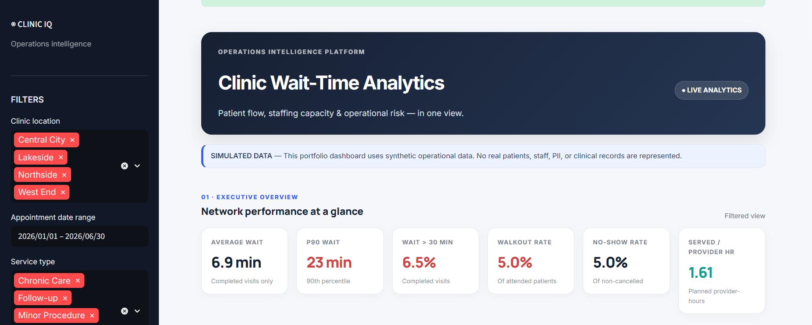
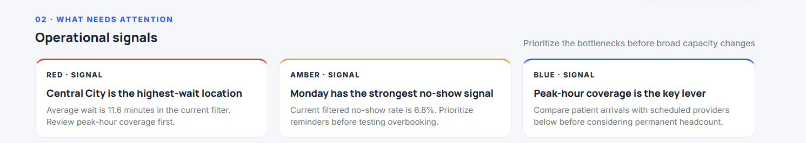
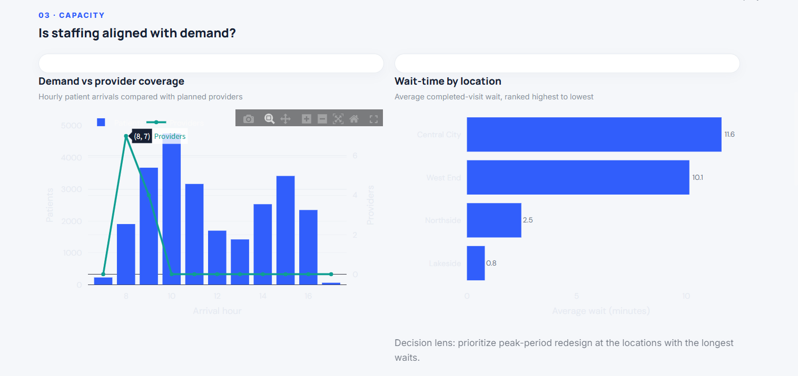
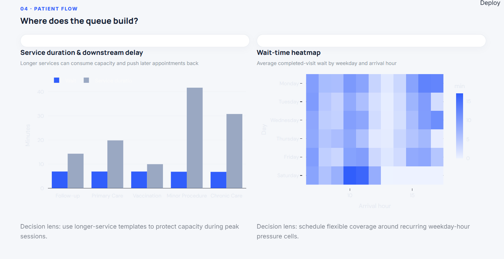
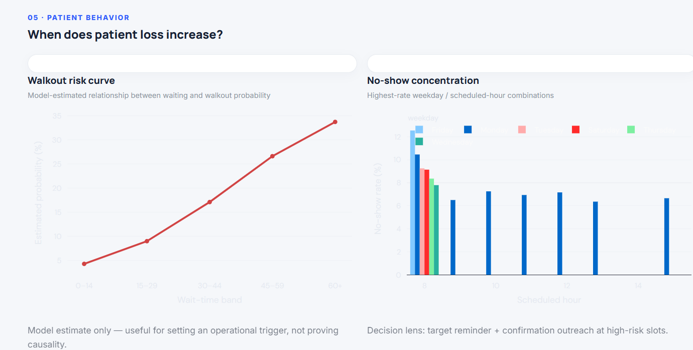
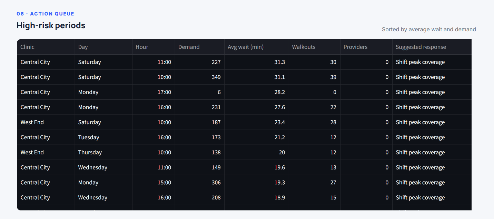
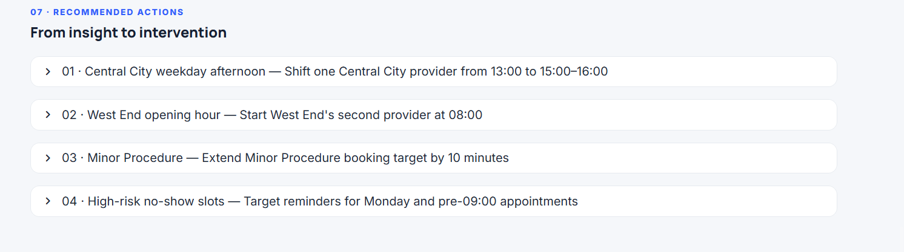

# Clinic Wait-Time Analytics

**Status: Stages 1–4 complete — simulated data only.**

This portfolio project models appointment flow, staffing coverage, service times, patient outcomes, and feedback to identify operational bottlenecks that affect patient wait times, capacity, no-shows, and walkouts.

The project uses **synthetic operational data only**. No real clinic, patient, staff, PII, or clinical records are represented.

---

## Project Overview

The goal of the project is to move from raw operational data to actionable decisions:

**Synthetic data → validation → KPI layer → operational analysis → interactive dashboard → recommended interventions**

The final dashboard is designed from an operations-management perspective, helping identify:

- Where patient wait times are highest
- Whether staffing coverage aligns with demand
- Which service types consume the most capacity
- When queues are most likely to build
- Where no-shows are concentrated
- How estimated walkout risk changes with waiting time
- Which clinic/day/hour combinations require attention
- What operational interventions could be tested

---

## Stage 1 — Synthetic Data Generation

### Assets

- `generate_data.py` — reproducible synthetic data generator
- `data/raw/` — simulated appointment and staff-shift source tables
- `data/cleaned/` — analysis-ready simulated tables
- `data/ASSUMPTIONS.md` — simulation design, assumptions, and limitations
- `reports/validation_report.md` — pre-analysis data validation results

### Reproducibility

Run from the project root:

```powershell
python generate_data.py
```

This regenerates the synthetic datasets and validation outputs.

---

## Stage 2 — Metric & KPI Layer

### Assets

- `calculate_metrics.py` — reproducible metric-calculation layer
- `data/cleaned/metrics/` — dashboard-ready KPI tables and enriched appointment-level data
- `reports/metric_definitions.md` — metric definitions, denominators, and output catalog

Core metrics include:

- Average / median / P90 wait
- Wait over 15 / 30 minutes
- No-show rate
- Walkout rate
- Cancellation rate
- Completion rate
- Average service duration
- Late-arrival metrics
- Appointments per provider
- Satisfaction and complaint metrics

Metric definitions use explicit populations and denominators to keep the analysis reproducible and interpretable.

---

## Stage 3 — Operational Analysis

### Assets

- `notebooks/clinic_wait_time_stage3_analysis.ipynb` — full simulated-data investigation
- `stage3_analysis.py` — reproducible analysis and chart/table generation
- `data/cleaned/metrics/` — operational hotspot, staffing-gap, service-duration, no-show, walkout-model, and recommendation tables

### Key analytical questions

The analysis investigates:

1. **Capacity** — Is staffing aligned with patient demand?
2. **Patient flow** — Where does the queue build?
3. **Service duration** — Which services create downstream capacity pressure?
4. **Patient behavior** — When do no-shows and walkouts increase?
5. **Operational hotspots** — Which clinic/day/hour combinations require attention?
6. **Scenario analysis** — What operational changes could be tested?

All scenario impacts are treated as **model estimates**, not proven real-world outcomes.

---

## Stage 4 — Interactive Dashboard

The final dashboard is built with **Streamlit, Pandas, and Plotly**.

Run it from the project root:

```powershell
python -m pip install -r requirements.txt
streamlit run dashboard/app.py
```

### Dashboard sections

#### 01 — Executive Overview

Provides a filtered operational snapshot including:

- Average wait
- P90 wait
- Wait over 30 minutes
- Walkout rate
- No-show rate
- Served appointments per provider hour

#### 02 — Operational Signals

Highlights the most important operational signals in the selected data:

- Highest-wait location
- Strongest no-show signal
- Peak-hour staffing pressure

#### 03 — Capacity

Compares:

- Hourly patient demand
- Planned provider coverage
- Average wait by clinic location

#### 04 — Patient Flow

Examines:

- Service duration versus waiting time
- Weekday/hour wait-time patterns
- Recurring queue-pressure periods

#### 05 — Patient Behavior

Explores:

- Model-estimated walkout risk by wait-time band
- No-show concentration by weekday and scheduled hour

#### 06 — Action Queue

Ranks high-risk clinic/day/hour combinations using:

- Demand
- Average wait
- Walkouts
- Provider coverage
- Suggested operational response

#### 07 — Recommended Actions

Converts analytical findings into testable operational interventions, such as:

- Shifting provider coverage toward peak periods
- Adjusting opening-hour staffing
- Extending booking targets for longer services
- Targeting reminders for high-risk no-show slots

---

## Dashboard Preview

### Executive Overview



### Operational Signals



### Capacity



### Patient Flow



### Patient Behavior



### Action Queue



### Recommended Actions



---

## Project Structure

```text
clinic-wait-time-analytics/
│
├── dashboard/
│   └── app.py
│
├── data/
│   ├── raw/
│   └── cleaned/
│       └── metrics/
│
├── images/
│   ├── 01_executive_overview.png
│   ├── 02_operational_signals.png
│   ├── 03_capacity.png
│   ├── 04_patient_flow.png
│   ├── 05_patient_behavior.png
│   ├── 06_action_queue.png
│   └── 07_recommended_actions.png
│
├── notebooks/
│   └── clinic_wait_time_stage3_analysis.ipynb
│
├── reports/
│   ├── metric_definitions.md
│   └── validation_report.md
│
├── generate_data.py
├── calculate_metrics.py
├── stage3_analysis.py
├── ASSUMPTIONS.md
├── requirements.txt
└── README.md
```

---

## Data & Validation

The simulated dataset contains:

- **25,211** appointment records
- **4,030** staff-shift records
- **21,890** completed appointments
- Appointment dates from **January 1, 2026 to June 30, 2026**

Validation checks include:

- Missing-value inspection
- Data-type validation
- Date and time-range checks
- Negative-wait checks
- Service-duration sanity checks
- Arrival-offset validation
- Staff-shift consistency checks

The validated simulated data produced an overall mean wait of **6.9 minutes** and a P90 wait of **23 minutes**.

---

## Important Limitations

This is a **portfolio demonstration using synthetic data**.

The simulation does not model:

- Real patient behavior
- Individual clinician preferences
- Room availability
- Clinician specialty matching
- Insurance processes
- Emergencies
- Rescheduling
- Unplanned staff absences
- Real-time breaks

The project also contains intentionally simulated operational relationships. Therefore, analytical patterns and scenario estimates should **not be interpreted as measured causal effects or predictions of real clinic performance**.

---

## Tech Stack

- **Python**
- **Pandas**
- **NumPy**
- **Plotly**
- **Streamlit**
- **Jupyter Notebook**
- **CSV**
- **Git / GitHub**

---

## What This Project Demonstrates

This project demonstrates an end-to-end analytics workflow:

**Data generation → data validation → metric engineering → exploratory analysis → operational diagnosis → visualization → interactive dashboard → decision support**

Rather than stopping at descriptive charts, the project connects analytical findings to specific operational questions and testable interventions.

---

**Clinic Wait-Time Analytics · Synthetic operational data · Portfolio project**
